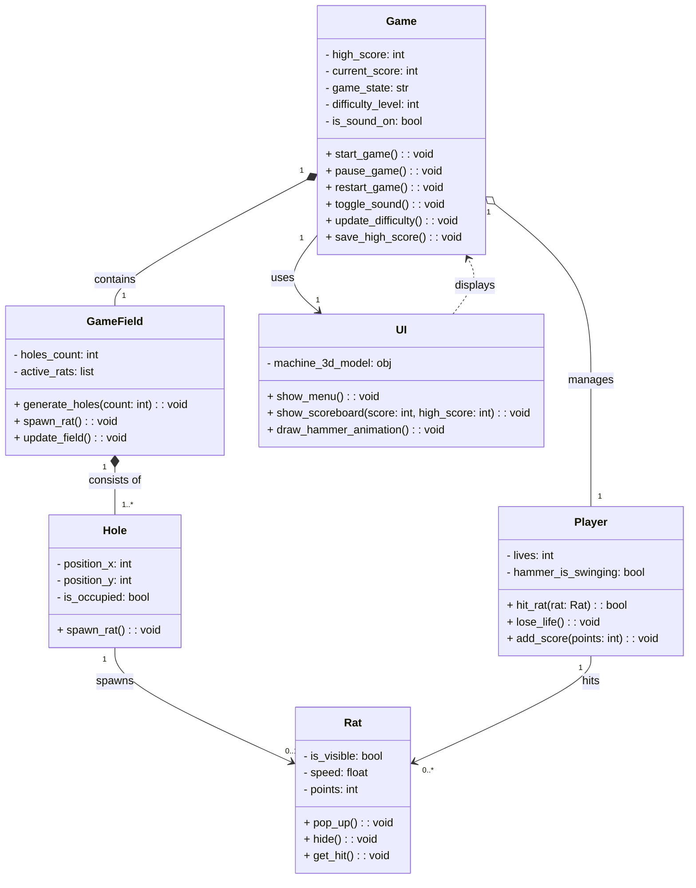

# UML-диаграмма классов Whack-a-Rat

```mermaid
classDiagram
    class Game {
        - high_score: int
        - current_score: int
        - game_state: str
        - difficulty_level: int
        - is_sound_on: bool
        + start_game(): void
        + pause_game(): void
        + restart_game(): void
        + toggle_sound(): void
        + update_difficulty(): void
        + save_high_score(): void
    }

    class Player {
        - lives: int
        - hammer_is_swinging: bool
        + hit_rat(rat: Rat): bool
        + lose_life(): void
        + add_score(points: int): void
    }

    class Rat {
        - is_visible: bool
        - speed: float
        - points: int
        + pop_up(): void
        + hide(): void
        + get_hit(): void
    }

    class GameField {
        - holes_count: int
        - active_rats: list
        + generate_holes(count: int): void
        + spawn_rat(): void
        + update_field(): void
    }

    class Hole {
        - position_x: int
        - position_y: int
        - is_occupied: bool
        + spawn_rat(): void
    }

    class UI {
        - machine_3d_model: obj
        + show_menu(): void
        + show_scoreboard(score: int, high_score: int): void
        + draw_hammer_animation(): void
    }

    Game "1" *-- "1" GameField : contains
    Game "1" o-- "1" Player : manages
    Game "1" --> "1" UI : uses
    GameField "1" *-- "1..*" Hole : consists of
    Hole "1" --> "0..1" Rat : spawns
    Player "1" --> "0..*" Rat : hits
    UI ..> Game : displays
```
